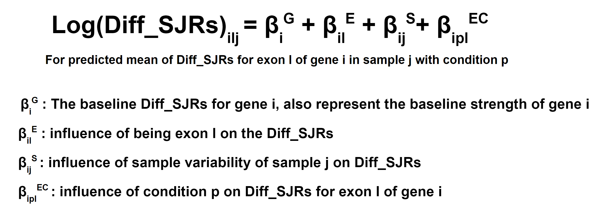
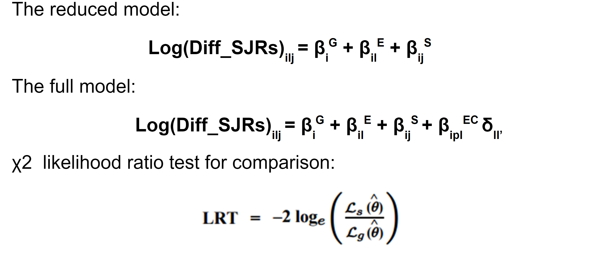

# HITIndex_stat_analysis

By Xingpei Zhang and Zachary Wakefield

The HITindex_Stat_analysis is a pipeline to analyze downstream data generated by HITindex pipeline. It utilized linear regression that adept from DEXSeq to detect differential AFE and ALE usage of a gene between conditions.

**Citation: Fiszbein A, McGurk M, Calvo Roitberg E, Kim GY, Burge CB, and Pai AA. (2021). Widespread occurrence of hybrid internal-terminal exons in human transcriptomes. (bioRxiv) doi: https://doi.org/10.1101/2021.05.27.446076**

**Anders S, Reyes A, Huber W. Detecting differential usage of exons from RNA-seq data. Genome Res. 2012 Oct;22(10):2008-17. doi: 10.1101/gr.133744.111. Epub 2012 Jun 21. PMID: 22722343; PMCID: PMC3460195.**

### Requirements (versions used for development)

- python (v3.6.3)

#### Python Dependencies
- scipy (v1.5.2)
- numpy (v1.19.2)
- pysam (v0.16)
- pandas (v0.25.3)
- pymc3 (v3.9.3)
- statsmodels
- arviz (v0.11)


### HITindex_stat_analysis
Detect differential AFE and ALE usage between conditions using linear regression. It requires outputs from the HITindex pipeline. This pipeline only test for genes that mostly expressed in both conditions and have AFEs or ALEs. Detail mechanism about how it work will be described in (Space reserved)

It will mark an exon as untestable following theses rules: 
1. There is only one first exon or last exon for the gene
2. It belong to a gene that expressed fewer than half of the time across all of the samples in one of the condition
3. Its Exoncount fall under the minimal Exon Count value set by user or it belong to a gene that have a GeneCount fall under minial GeneCount set by user
4. The exon read of this exon is cause by an outlier
```

usage: python HITindex_stat_analysis.py [--statAnalysis] [--condition1] [--condition2] 
                     [--biosignificant] [--output] [--minimalGeneCount] [--minimalExonCount] [criticalValue]

optional arguments:
  -h, --help            show this help message and exit
  --statAnalysis              perform statistical analysis on HITindex results (default: False)


stat analysis information:
--condition1              file names for all condition1 samples, connected with ',' (default:None)

--condition2              file names for all condition2 samples, connected with ',' (default:None)

--biosignificant          threshold for PSI different of an exon between conditions in order to 
                          be considered as biological significantly difference (default: 0.2)

--output                  the base name of the output files (default: Hitindex_stat_interpretation)

--minimalGeneCount        the minimal total reads of a gene that required for this gene to be 
                          considered for statistical analysis, this term is use to eliminate genes 
                          that only have a small reads those are subjected to chances. (default: 20)

--minimalExonCount        the minimal total reads of a exon that required for this exon to be 
                          considered for statistical analysis, this term is use to eliminate exon that 
                          only have a small reads those are subjected to chances. (default: 15)

--criticalValue           the critical value for stat analysis, takes in between 0.0 and 1.0 
                          (default: 0.01)
--multipleTesting           this parameter decides what method will be used for the correction for multiple testing in p-values.
                          It has ten options.
                          May select any input for multiple testing correction in the statsmodels.stats.multitest.multipletests() function:
                          suggested methods include: bonferroni or fdr_bh (bonferroni will have more false negatives, fdr_bh will have more false                                   positives) 
                          (default: fdr_bh)                          
--outlierDetection        this parameter decided how the outlier will be detected. It have six options.
                          When outlierMethod = iqr:
                          default: when the number of both conditions is lower than 5 samples it will detect
                          outlier across all samples, otherwise it will detect outlier within the samples of 
                          a condition.
                          merge: detect outlier across all samples
                          separate: detect outlier within a single condition
                          When outlierMethod = cooks:
                          Different cut off methods, depending on your data set: 4/n, 4*mean, 1
                          Each of these are traditional methods for cooks cutoff
                          (default: 4/n)
--outlierMethod           this parameter decides what method will be used for outlier detection in PSI value.
                          It has three options.
                          cooks: using cook's distance to detect outliers based on the impact they have on regression
                          iqr: using interquartile range to filter out outlier psi values
                          none: not doing outlier detection
                          (default: cooks)
```
## Detailed Tutorial to run the HITindex_Stat_Analysis

In this tutorial, we walk through all the steps to run the HITindex_Stat_Analysis pipeline, in the minimum number of command lines and each step individually. For each step, we discuss the possible parameters that can be changed, how to do so, and the considerations involved in each of the parameters. Finally, we show example inputs and outputs of each step (with column explanations) so the user knows what to expect and can make custom files as needed.


### Step 0: HITindex calculation:
Plase refer to the HITindex pipeline for how to perform HITindex calculation: https://github.com/thepailab/HITindex

### Step 1: Perform HITindex_stat_analysis:

The linear regression model for differetnial AFE and ALE usage is adepted from Anders et al. (2012). It assume that the average between upstream and downstream spliced junction reads for an exon can be regress by a log-linear model

<p align="center">

</p>

Then, HITindex_stat_analysis use χ 2 likelihoof ratio test to compare a reduce model with a full model and test on whether condition have an influence on difference between spliced junction reads which is a direct estimator for AFEPSI and ALEPSI according to Fiszbein et al. (2022). 

<p align="center">

</p>


This is a sample run for HITindex_stat_analysis
```
python HITindex_stat_analysis.py --statAnalysis --condition1 sample1,sample2,sample3 --condition2 sample4,sample5,sample6 --biosignificant 0.1 --minimalGeneCount 10 --minimalExonCount 5 --criticalValue 0.01 --outlierDetection default --output test
```
Here is the minimal command required to run HITindex_stat_analysis
```
python HITindex_stat_analysis.py --statAnalysis --condition1 sample1,sample2,sample3 --condition2 sample4,sample5,sample6 --output test
```

**Output**
This step result in 5 files: outname outname.AFEPSI outname.ALEPSI outname.genelist outname.diffexons

outname contain following columns:

| Column Name | Description |
| ----------- | ----------- |
| gene   | gene name |
| exon | exon name|
| p_value | the p-value for the test on whether this exon is differentially expressed between conditions, and -1 stand for untestable result |
| 0.1 | whether the different is significant when α = 0.1 |
| 0.05 | whether the different is significant when α = 0.05 |
| 0.01 | whether the different is significant when α = 0.01 |
| total_condition1_read | number of different between spliced junction reads across all condition1 samples for the exon (definition about spliced junction reads please see HITindex pipeline) |
| total_condition2_read | number of different between spliced junction reads across all condition2 samples for the exon |
| average_condition1_read | number of different between spliced junction reads across all condition1 samples for the exon devided by number of samples |
| average_condition1_read |  number of different between spliced junction reads across all condition2 samples for the exon devided by number of samples |
| sample_names.PSI | the PSI value of this exon in samples, number of columns depend on how many samples get imported |
| type | whether this exon is AFE or ALE |
| outlier | the ourlier for this exon |
| delta_PSI | the difference of average PSI between two conditions excluding outliers|
| log2fc | the log2 fold change between the two conditions (log2(cond1/cond2))|
| bio_significant | whether the PSI different between conditions are biological significant which is set by user and default is 0.1 |

outname.AFEPSI and outname.AFEPSI contain following columns:

| Column Name | Description |
| ----------- | ----------- |
| gene   | gene name |
| exon | exon name|
| sample_names.difference | different between spliced junction reads for this samples, number of columns depend on how many samples get imported |
| sample_names.PSI | the PSI value of this exon in samples, number of columns depend on how many samples get imported |
| type | whether this exon is AFE or ALE |


outname.genelist contain following columns:

| Column Name | Description |
| ----------- | ----------- |
| differentially_expressed_gene | gene name for gene that show differential AFE or ALE usage|
| exons | exon names for all differentially used exon in this gene|
| types | the types for all differentially used exon |


outname.diffexons contain following columns:

| Column Name | Description |
| ----------- | ----------- |
| gene   | gene name for gene that include differentially used AFE or ALE between conditions |
| exon | exon name for exon that show differentially used exon |
| p_value | the p-value for the test on whether the exon is differentially expressed between conditions|
| delta_PSI | the difference of average PSI between condtion1 and condition2 excluding outliers, calculated as average of condition2 PSI - average of condition1 PSI (outlier please refer to outname)|
| type | whether this exon is AFE or ALE |

Within these files, outname.AFEPSI and outname.ALEPSI is a summary for HITindex result that get used in HITindex_stat_analysis. outname contain all the result from HItindex_stat_analysis. outname.genelist and outname.diffexons is a summary for some result from the HITindex_stat_analysis and they are intend for convenient downstream analysis.


